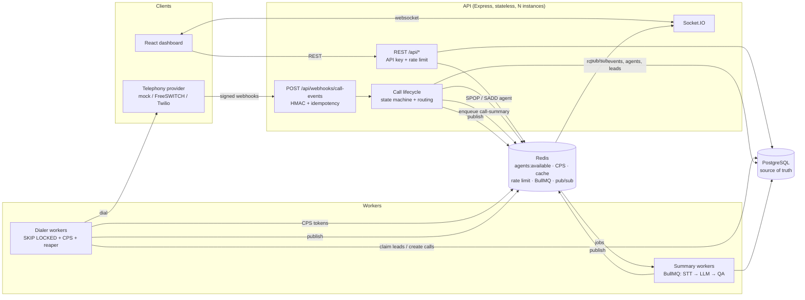

# Mini Dialer Platform — AI-assisted outbound contact center backend

Supervisors create **campaigns** and upload **leads**. A **dialer worker** claims leads safely across
many worker processes, respects a per-campaign **calls-per-second** limit and the **Do-Not-Call** list,
and places calls through a telephony provider. When a call is answered, the platform **atomically routes
it to a free agent**. When it ends, a background job **transcribes, summarises and QA-scores** it. A
React **supervisor dashboard** shows agents, live calls, campaign stats and searchable call logs in real
time. Telephony, speech-to-text and the LLM are simulated behind interfaces
(`TelephonyProvider`, `SttProvider`, `LlmProvider`), so real providers can be plugged in later.

The focus is production-grade engineering: correctness under concurrency, idempotency, transactions,
compensation, clear errors, and documented trade-offs. See **[docs/DECISIONS.md](docs/DECISIONS.md)**.

---

## Architecture



**Call flow:**
1. The dialer claims pending leads (`FOR UPDATE SKIP LOCKED`), re-checks DNC, and creates `Call` rows
   with our own `providerCallId`.
2. It commits, then dials.
3. Webhooks arrive: `ringing` → `answered`. On `answered`, `SPOP agents:available` plus a conditional DB
   update assigns an agent; if none is free, the call is `abandoned`.
4. On `completed`, the agent is released (DB then Redis), the lead is completed, and a summary job is
   enqueued.
5. The summary worker writes the transcript, summary, `qaScore` and flags.
6. Every change is pushed to the dashboard through Redis pub/sub → Socket.IO.

---

## Quick start

Requirements: **Node.js 20+**, **Docker** (for Postgres 16 + Redis 7).

```bash
cp .env.example .env
docker compose up -d && npm i && npm run migration:run && npm run seed && npm run dev
```

API on http://localhost:3000. Check it: `curl localhost:3000/health`.

### Everything in Docker (Docker Desktop)

One command runs Postgres, Redis, migrations + seed, the API, the dialer, the summary worker and the
dashboard:

```bash
cp .env.example .env                              # edit *_HOST_PORT if 5432/6379/3000/8080 are taken
docker compose --profile app up -d --build
docker compose ps                                 # migrate shows "Exited (0)", the rest "running"
```

- Dashboard: http://localhost:8080 (nginx proxies `/api` and `/socket.io` to the API container)
- API: http://localhost:3000/health
- Logs: `docker compose logs -f api dialer summary`
- Load simulation (from your machine, against the containers): `npm i && npm run simulate`
- Stop: `docker compose --profile app down`. Add `-v` to also wipe the database/Redis volumes.
- After code changes: `docker compose --profile app up -d --build`

Inside the compose network the containers use `postgres:5432` / `redis:6379`, and the dialer's mock
telephony posts webhooks to `http://api:3000`. `DATABASE_URL`/`REDIS_URL` in `.env` only matter for
processes you run on the host (`npm run dev`, `npm test`, the simulator), so point them at the
published host ports.

> **Without Docker:** point `DATABASE_URL` / `REDIS_URL` in `.env` at your own Postgres (13+) and
> Redis (BullMQ needs **≥ 5**, recommends **≥ 6.2**; old Windows ports like 3.0 won't work), and create a
> `mini_dialer_test` database for the tests.

### Run the workers (separate terminals)

```bash
npm run worker:dialer     # claims leads, enforces CPS, dials; also runs the stuck-work reaper
npm run worker:summary    # BullMQ worker: mock STT → mock LLM → summary + QA score
```

Both can run as **multiple instances** safely.

### Run the end-to-end simulation

With the API and both workers running (and `MOCK_TELEPHONY_WEBHOOK_URL` set in `.env`, as in
`.env.example`):

```bash
npm run simulate                                     # 500 leads, 8 agents, 5 CPS
npm run simulate -- --leads 500 --agents 8 --cps 10  # knobs
```

It seeds agents + DNC numbers, creates a campaign, uploads ~500 leads (including duplicates and invalid
numbers), starts it, and prints progress until every lead has a final state. The mock provider sends
random ringing/answered/no_answer/failed outcomes with random durations, **duplicate deliveries** and
**out-of-order events**. Set `MOCK_TELEPHONY_SPEED=0.5` for a faster run.

### Dashboard

```bash
cp web/.env.example web/.env      # VITE_API_KEY must equal API_KEY in .env
npm --prefix web install
npm run web:dev                   # http://localhost:5173 (proxies /api and /socket.io to :3000)
```

Pages: **Live dashboard** (campaign stat cards, live calls, agent panel with availability toggles),
**Call logs** (filters, pagination, detail drawer with timeline, summary, QA flags, transcript),
**Campaigns** (create, start/pause, CSV/JSON lead upload).

### Tests

```bash
cp .env.test.example .env.test    # points at the mini_dialer_test DB and Redis DB 1
npm test                          # unit + integration (real Postgres + Redis, real migrations)
npm run concurrency:check         # prints a PASS/FAIL report of the core guarantees
```

What the integration tests prove:

| Scenario | Guarantee |
|---|---|
| Same webhook `eventId` sent 10× concurrently | Exactly 1 `CallEvent`, call processed once, 1 agent claimed |
| 50 concurrent `answered` events, 5 available agents | Exactly 5 calls get agents, all distinct; 45 abandoned |
| 2 dialer workers in parallel on 100 leads | Each lead dialed exactly once, both workers participated |
| 8 concurrent dialer ticks, `maxCps = 3` | Never more than 3 calls in any second |
| DB failure after `SPOP` (trigger throws mid-transaction) | Agent returned to Redis (compensation); provider retry succeeds |
| Stale agent id in Redis | Never double-assigned (DB guard) |
| Lead upload with duplicates + DNC + invalid numbers | Correct `{ inserted, duplicates, dnc, invalid }` |
| Out-of-order / post-terminal events | Stored with `applied=false`, state unchanged |
| BullMQ job fails twice | Retried with backoff, then succeeds; STT not paid twice |
| Call list filters | `EXPLAIN` shows each filter uses its index |

### Scripts

| Script | Purpose |
|---|---|
| `dev` / `build` / `start` | API in watch mode / compile to `dist` / run compiled API |
| `worker:dialer` / `worker:summary` | Workers (ts-node). Compiled: `start:dialer`, `start:summary` |
| `migration:generate -- src/db/migrations/Name` / `migration:run` / `migration:revert` | TypeORM migrations (`synchronize` is always off) |
| `migration:run:prod` | Run compiled migrations from `dist` |
| `seed` | Idempotent demo data (5 agents, DNC numbers, a draft campaign with 50 leads) |
| `simulate` | End-to-end load simulation |
| `test` / `test:unit` / `concurrency:check` | Tests / unit only / PASS-FAIL concurrency report |
| `lint` / `typecheck` / `format` | ESLint / `tsc --noEmit` / Prettier |
| `web:dev` / `web:build` | Dashboard dev server / production build |

---

## API reference

Base path `/api`. All `/api/*` routes need `X-API-Key: <API_KEY>`, except webhooks, which need
`X-Signature`.

- Success responses: `{ "success": true, "data": …, "meta": { "page", "limit", "total" } }`.
- Error responses: `{ "success": false, "error": { "code", "message", "details"? } }`.
- Pagination: `page` (1-based), `limit` (default 20, max 100).

| Method | Path | Description | Notable responses |
|---|---|---|---|
| GET | `/health` | DB + Redis check (no auth) | 200 / 503 |
| POST | `/api/agents` | Create agent `{ name, email }` (starts `offline`) | 201, 409 duplicate email |
| GET | `/api/agents?status=&page=&limit=` | List agents | 200 |
| GET | `/api/agents/:id` | Get agent | 200, 404 |
| PATCH | `/api/agents/:id/status` | `{ status: "available" \| "offline" }` — DB first, then Redis set | 200, 409 if busy |
| POST | `/api/campaigns` | `{ name, maxCps?=2, maxAttempts?=3 }` | 201 |
| GET | `/api/campaigns?status=&page=&limit=` | List campaigns | 200 |
| GET | `/api/campaigns/:id` | Get campaign | 200, 404 |
| PATCH | `/api/campaigns/:id` | Update name / maxCps / maxAttempts | 200, 422 if completed |
| DELETE | `/api/campaigns/:id` | Delete (cascades leads/calls) | 204, 409 if running |
| POST | `/api/campaigns/:id/start` | draft/paused → running (idempotent) | 200, 422 |
| POST | `/api/campaigns/:id/pause` | running → paused (idempotent) | 200, 422 |
| POST | `/api/campaigns/:id/leads` | Body: `[{ phone, name? }]` (≤ 5,000). Returns `{ inserted, duplicates, dnc, invalid }` | 201, 400, 404 |
| GET | `/api/campaigns/:id/leads?status=&page=&limit=` | Paginated leads | 200, 404 |
| GET | `/api/campaigns/:id/stats` | Totals, by status, answered, answer rate, avg duration, avg QA (cached 30 s, `X-Cache`) | 200, 404 |
| POST | `/api/dnc` | `{ numbers: [{ phone, reason? }] }`; also blocks pending leads | 201 |
| GET | `/api/dnc?page=&limit=` | List DNC numbers | 200 |
| DELETE | `/api/dnc/:phone` | Remove from DNC | 204, 404 |
| GET | `/api/calls?status=&agentId=&campaignId=&from=&to=&page=&limit=` | Filtered, `createdAt desc`. `status` accepts a comma list | 200, 400 |
| GET | `/api/calls/:id` | Call + lead + agent + campaign + events timeline + transcript/summary/QA | 200, 404 |
| POST | `/api/webhooks/call-events` | Telephony events (HMAC, idempotent, state machine) | 200 `processed` / `duplicate_ignored` / `ignored`, 401, 404 |

**Webhook format.** Body:

```json
{ "eventId": "evt_123", "providerCallId": "…", "type": "answered", "timestamp": "2030-01-01T10:00:00Z", "payload": {} }
```

`type` is one of `ringing | answered | completed | no_answer | failed`. The header is
`X-Signature: sha256=<hex HMAC-SHA256(rawBody, WEBHOOK_SECRET)>`.

```bash
BODY='{"eventId":"e1","providerCallId":"<id>","type":"ringing","timestamp":"2030-01-01T10:00:00Z"}'
SIG=$(printf '%s' "$BODY" | openssl dgst -sha256 -hmac "$WEBHOOK_SECRET" | sed 's/^.* //')
curl -X POST localhost:3000/api/webhooks/call-events -H 'Content-Type: application/json' \
  -H "X-Signature: sha256=$SIG" -d "$BODY"
```

**Socket.IO events** (handshake `auth: { apiKey }`): `agent:updated`, `call:updated`, `campaign:updated`.

---

## Project layout

```
src/
  config/env.ts            zod-validated env (the only reader of process.env), fail-fast
  db/                      data-source, migrations, seed
  entities/                Agent, Campaign, Lead, DncNumber, Call, CallEvent (+ enums)
  modules/<name>/          *.routes → *.controller (HTTP only) → *.service (logic, transactions)
    agents/                agentPool (Redis set), agentRouting (claim/release)
    calls/                 callStateMachine, callLifecycle.service (the core), list/detail
    webhooks/ campaigns/ leads/ dnc/ stats/ health/
  workers/                 dialer.ts + dialer.worker.ts, reaper.ts, cpsLimiter.ts, summary(.worker).ts
  providers/               telephony / STT / LLM interfaces + mocks
  lib/                     redis, queue, realtime (pub/sub), socket, logger, sql, lua scripts, …
  middlewares/             errorHandler, validate, rateLimit, auth, requestId, cors, webhook HMAC
tests/unit, tests/integration, scripts/, web/, deploy/, docs/DECISIONS.md
```

---

## Scaling to 10×

- **Stateless API behind a load balancer.** No in-process state: sessions, rate limits, the agent
  pool and realtime fan-out all live in Redis. Add API instances freely. Socket.IO needs no sticky
  sessions (websocket-only transport; every instance re-emits the Redis pub/sub stream).
- **Horizontal workers.** `FOR UPDATE SKIP LOCKED` gives each dialer worker disjoint leads without
  blocking, and the CPS budget is a shared Redis counter, so dialers scale out without coordination.
  Summary workers scale via BullMQ (more instances or higher concurrency). Hot campaigns can be
  sharded across dialers by `hash(campaignId)` to cut contention further.
- **Database.**
  - Put **PgBouncer** in transaction mode in front of Postgres, and keep per-process pools small.
  - Add **read replicas** for call logs, stats and dashboards (the write path stays on the primary).
  - **Partition** `calls` and `call_events` by month (`createdAt` / `receivedAt`) so indexes stay small
    and old months can be detached and archived to S3.
  - Use keyset pagination for deep call-log pages.
- **Redis.** Move to **ElastiCache** (cluster mode, Multi-AZ). Keep BullMQ on its own Redis (queues
  need `noeviction`), separate from the cache (which can use `allkeys-lru`).
- **Managed services.** RDS PostgreSQL (Multi-AZ, automated backups, Performance Insights) plus
  ElastiCache replace the single EC2 host's databases.
- **Hot paths.** Maintain stats incrementally (`HINCRBY` per transition) instead of `GROUP BY`. Use a
  transactional outbox for post-commit side effects. Pace dialing by free agents to cut abandonment.
- **Observability.**
  - Structured JSON logs with request ids are already in place; ship them to CloudWatch or OpenSearch.
  - Metrics to track: dial rate vs CPS, answer rate, abandonment rate, routing latency, webhook p99,
    queue depth/failed jobs, DB pool saturation, lock waits.
  - OpenTelemetry tracing across API → queue → worker.
  - Alerts on abandonment above 3%, stuck calls, and the reaper firing.

---

## Deployment (AWS EC2 + PM2 + Nginx)

Single-host setup (fine for a demo or small team). For production, use RDS + ElastiCache and 2+ EC2
instances behind an ALB.

1. **Provision**
   - Launch Ubuntu 22.04/24.04 (t3.small+).
   - Security group: 22 (your IP), 80/443 (world). Keep 3000/5432/6379 closed.
   - For production, create **RDS PostgreSQL 16** and **ElastiCache Redis 7** in the same VPC, with
     security groups allowing only the app instances.
2. **Install**
   ```bash
   curl -fsSL https://deb.nodesource.com/setup_20.x | sudo -E bash -
   sudo apt-get install -y nodejs nginx git
   sudo npm i -g pm2
   # Demo-only local datastores (skip when using RDS/ElastiCache):
   sudo apt-get install -y docker.io docker-compose-v2 && sudo usermod -aG docker $USER
   ```
3. **Deploy the code**
   ```bash
   sudo mkdir -p /srv/mini-dialer && sudo chown $USER /srv/mini-dialer
   git clone <repo> /srv/mini-dialer && cd /srv/mini-dialer
   cp .env.example .env   # set NODE_ENV=production, DATABASE_URL, REDIS_URL,
                          # strong API_KEY / WEBHOOK_SECRET, CORS_ORIGIN, LOG_LEVEL=info;
                          # leave MOCK_TELEPHONY_WEBHOOK_URL empty unless demoing
   docker compose up -d   # demo only
   npm ci && npm run build && npm run migration:run:prod
   npm --prefix web ci && VITE_API_KEY=<API_KEY> npm run web:build
   ```
4. **Run under PM2**
   ```bash
   pm2 start ecosystem.config.js --env production   # api (cluster ×2), dialer ×2, summary ×1
   pm2 save && pm2 startup                          # restart on reboot
   pm2 logs / pm2 monit
   ```
5. **Nginx + TLS**
   ```bash
   sudo cp deploy/nginx.conf /etc/nginx/sites-available/mini-dialer   # edit server_name
   sudo ln -s /etc/nginx/sites-available/mini-dialer /etc/nginx/sites-enabled/
   sudo nginx -t && sudo systemctl reload nginx
   sudo snap install --classic certbot && sudo certbot --nginx -d dialer.example.com
   ```
6. **Zero-downtime updates**
   ```bash
   git pull && npm ci && npm run build && npm run migration:run:prod
   pm2 reload ecosystem.config.js
   ```
   Keep migrations backward compatible (expand → deploy → contract). All processes handle `SIGTERM`
   gracefully:
   - the API stops accepting connections and drains requests,
   - dialers finish their in-flight batch,
   - summary workers finish active jobs.

> Security notes: the dashboard build embeds the API key, which is acceptable only for an internal tool
> on a private network or behind SSO. Real deployments should put user auth (OIDC) in front. Rotate
> `WEBHOOK_SECRET` with your provider, and keep `.env` readable only by the app user.
